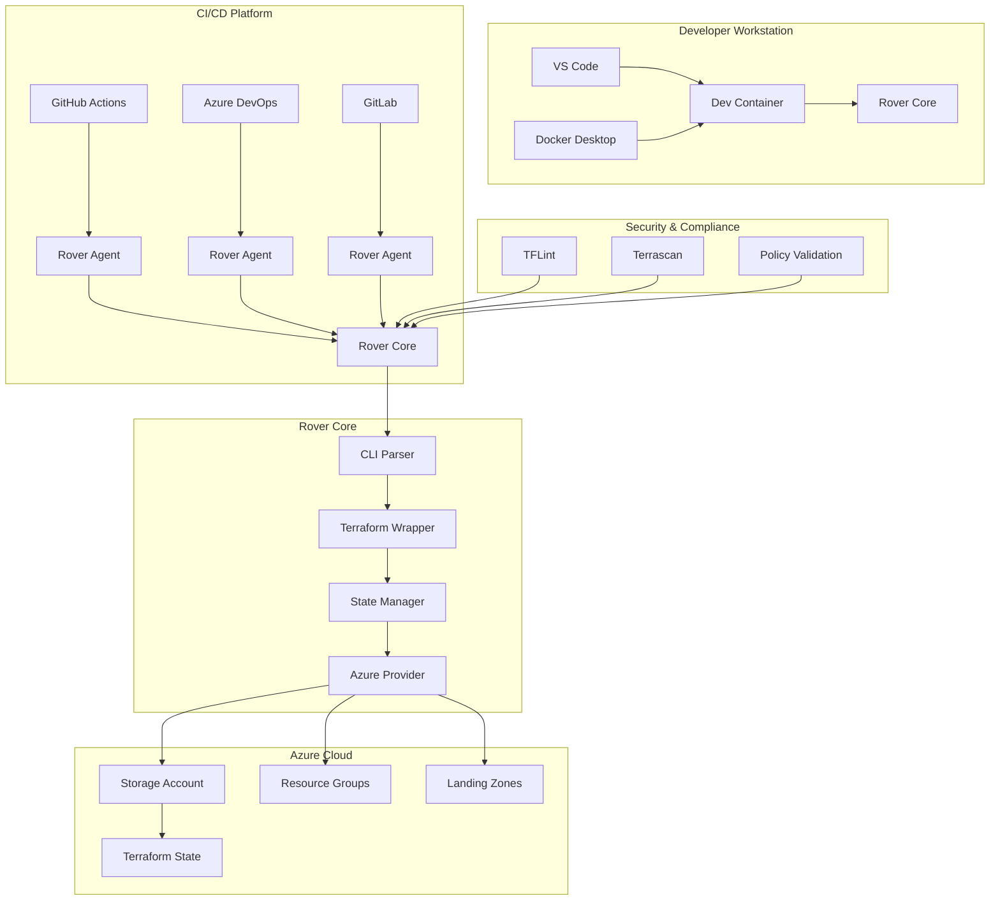
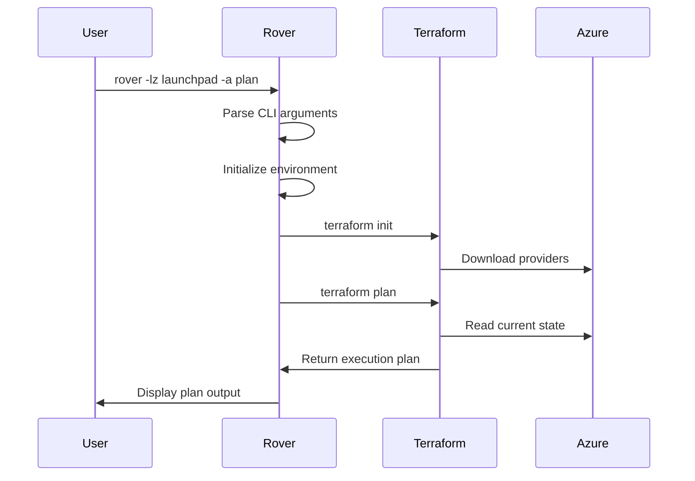
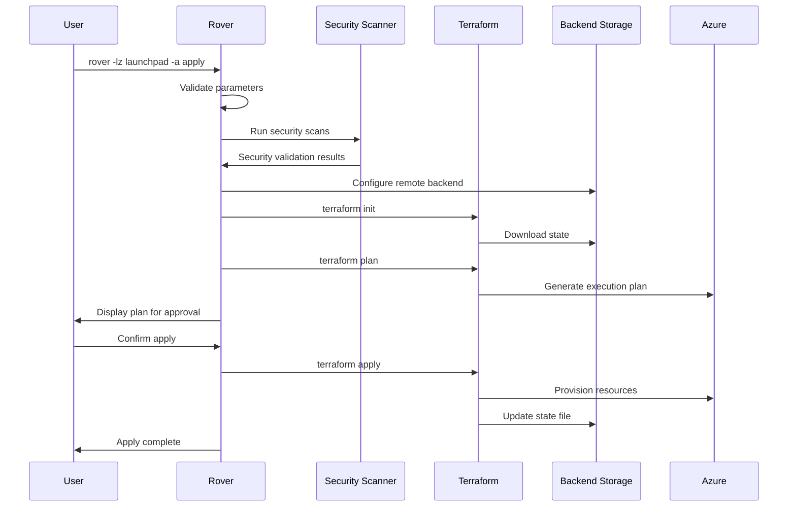
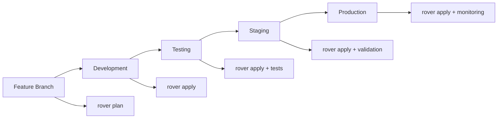
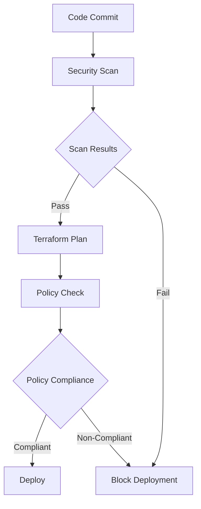
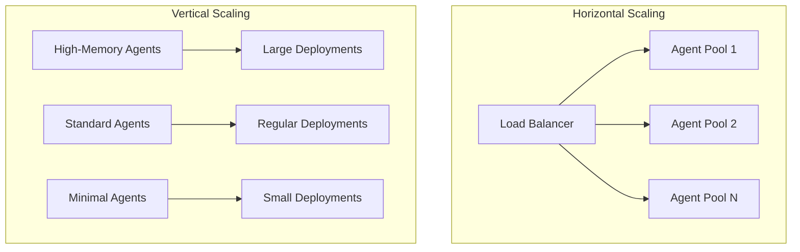

# Rover Architecture

This document provides a comprehensive overview of the Azure Terraform SRE Rover architecture, components, and design principles.

## 📋 Table of Contents

- [Overview](#overview)
- [System Architecture](#system-architecture)
- [Core Components](#core-components)
- [Container Architecture](#container-architecture)
- [Terraform Workflow](#terraform-workflow)
- [State Management](#state-management)
- [CI/CD Integration](#cicd-integration)
- [Security Architecture](#security-architecture)
- [Extension Points](#extension-points)

## Overview

Rover is designed as a containerized Terraform wrapper that provides enterprise-grade capabilities for managing Azure infrastructure at scale. The architecture follows containerization best practices and implements the Cloud Adoption Framework (CAF) patterns.

### Key Design Principles

- **🐳 Container-First**: Everything runs in containers for consistency
- **🔄 Stateless**: No persistent state in the container itself
- **🛡️ Security-First**: Built-in security scanning and policy enforcement
- **📦 Modular**: Extensible through agents and plugins
- **🌐 Multi-Platform**: Runs on any container platform
- **🔧 Toolchain Integration**: Comprehensive DevOps toolset included

## System Architecture



## Core Components

### 1. Rover Core (`scripts/rover.sh`)

The main entry point and orchestration engine:

```bash
# Main components sourced by rover.sh
scripts/
├── rover.sh              # Main entry point and orchestrator
├── functions.sh          # Core utility functions
├── parse_command.sh      # CLI argument parsing
├── tfstate.sh           # Terraform state management
├── remote.sh            # Remote backend configuration
├── ci.sh                # Continuous integration workflows
├── cd.sh                # Continuous deployment workflows
└── lib/                 # Core library functions
    ├── bootstrap.sh     # Environment initialization
    ├── init.sh          # Terraform initialization
    ├── logger.sh        # Logging and output management
    └── parse_parameters.sh # Parameter validation
```

**Key Responsibilities:**
- Command-line interface parsing
- Environment initialization
- Terraform workflow orchestration
- Error handling and logging
- State management coordination

### 2. Terraform Wrapper

Provides enterprise features around standard Terraform:

```bash
# Terraform workflow stages
terraform init    # Backend configuration + provider download
terraform validate # Syntax and configuration validation  
terraform plan    # Execution plan generation
terraform apply   # Infrastructure provisioning
terraform destroy # Resource cleanup
```

**Enhanced Features:**
- Automatic backend configuration
- State file encryption and versioning
- Plan artifact storage
- Policy validation integration
- Cost estimation hooks

### 3. State Manager (`scripts/tfstate.sh`)

Manages Terraform state files with enterprise features:

**Capabilities:**
- Azure Storage Account integration
- State file encryption at rest
- Automatic state locking
- State versioning and backup
- Cross-environment state isolation

**State Structure:**
```
Storage Account: stterraformXXXXX
├── Container: tfstate
│   ├── level0/
│   │   ├── environment1/
│   │   │   └── tfstate.terraform
│   │   └── environment2/
│   └── level1/
└── Container: tfstate-backup
    └── versioned-backups/
```

### 4. CI/CD Integration Layer

Supports multiple CI/CD platforms through specialized agents:

#### Agent Architecture
```dockerfile
# Base: Rover Core + CI/CD Platform Tools
FROM aztfmod/rover:latest as base

# Platform-specific layer
FROM base as github-agent
RUN install-github-runner

FROM base as azdo-agent  
RUN install-azdo-agent

FROM base as gitlab-agent
RUN install-gitlab-runner
```

**Supported Platforms:**
- **GitHub Actions**: Self-hosted runners with rover pre-installed
- **Azure DevOps**: Custom agent pools with enterprise tooling
- **GitLab CI**: Shared runners or self-hosted with rover
- **Terraform Cloud**: Custom agents for TFC/TFE integration

## Container Architecture

### Base Image Structure

```dockerfile
# Multi-stage build process
FROM ubuntu:20.04 as base
# System dependencies and security updates

FROM base as tools
# Install core tools: terraform, azure-cli, kubectl, helm

FROM tools as security
# Install security tools: tflint, terrascan, checkov

FROM security as rover
# Install rover scripts and configuration
# Set up user environment and entrypoint
```

### Installed Toolchain

| Category | Tools | Purpose |
|----------|--------|---------|
| **Core** | Terraform, Azure CLI | Infrastructure provisioning |
| **Container** | Docker, kubectl, Helm | Container orchestration |
| **Security** | TFLint, Terrascan, Checkov | Security and compliance scanning |
| **Development** | Git, jq, curl, vim | Development utilities |
| **Observability** | Azure Monitor integration | Logging and monitoring |

### Volume Mounts

```bash
# Production deployment
docker run -it \
  -v ~/.azure:/home/vscode/.azure \           # Azure credentials
  -v $(pwd):/tf/caf \                         # Terraform configurations
  -v ~/.terraform.cache:/home/vscode/.terraform.cache \ # Terraform cache
  aztfmod/rover:latest
```

## Terraform Workflow

### Standard Workflow



### Enhanced Enterprise Workflow



## State Management

### Backend Configuration

Rover automatically configures Terraform backends:

```hcl
# Auto-generated backend.tf
terraform {
  backend "azurerm" {
    resource_group_name  = "rg-terraform-state"
    storage_account_name = "stterraform${random_id}"
    container_name       = "tfstate"
    key                  = "${environment}/${level}/${workspace}.tfstate"
    
    # Security features
    use_azuread_auth = true
    use_msi         = true
  }
}
```

### State Isolation Strategy

```
Subscription
├── Management Groups
├── Level 0 (Platform Foundation)
│   ├── Identity & Access Management
│   ├── Management & Monitoring  
│   └── Connectivity
├── Level 1 (Platform Shared Services)
│   ├── Shared Networking
│   ├── Shared Security
│   └── Shared Management
├── Level 2 (Application Landing Zones)
│   ├── Corp Connected Apps
│   ├── Online Apps
│   └── Sandbox/Dev
└── Level 3 (Application Resources)
    ├── Data Platform
    ├── Analytics Platform
    └── AI/ML Platform
```

### State Security

- **Encryption**: AES-256 encryption at rest
- **Access Control**: Azure RBAC integration  
- **Versioning**: Automatic state versioning
- **Backup**: Daily automated backups
- **Auditing**: All state changes logged

## CI/CD Integration

### Pipeline Architecture

```yaml
# Example GitHub Actions integration
name: Infrastructure Deployment
on:
  push:
    paths: ['terraform/**']

jobs:
  deploy:
    runs-on: self-hosted
    container: aztfmod/rover:latest
    
    steps:
    - uses: actions/checkout@v3
    
    - name: Terraform Plan
      run: |
        rover -lz ./terraform/landing-zones/launchpad \
              -a plan \
              -env ${{ github.ref_name }} \
              -level level0
    
    - name: Terraform Apply
      if: github.ref == 'refs/heads/main'
      run: |
        rover -lz ./terraform/landing-zones/launchpad \
              -a apply \
              -env production \
              -level level0
```

### Environment Promotion



## Security Architecture

### Security Layers

1. **Container Security**
   - Non-root user execution
   - Minimal attack surface
   - Regular security updates
   - Vulnerability scanning

2. **Code Security**
   - Static analysis with TFLint
   - Policy validation with Terrascan
   - Secret scanning with git-secrets
   - Configuration validation

3. **Access Security**
   - Azure AD integration
   - Service principal authentication
   - Managed identity support
   - RBAC enforcement

4. **Network Security**
   - Private endpoint support
   - VNet integration
   - NSG rule validation
   - Traffic encryption

### Security Scanning Pipeline



## Extension Points

### Custom Agents

```dockerfile
# Example custom agent
FROM aztfmod/rover:latest

# Add custom tools
RUN apt-get update && apt-get install -y \
    custom-security-tool \
    custom-monitoring-agent

# Add custom scripts
COPY custom-scripts/ /usr/local/bin/

# Configure custom entrypoint
COPY entrypoint.sh /entrypoint.sh
ENTRYPOINT ["/entrypoint.sh"]
```

### Plugin Architecture

```bash
# Plugin structure
plugins/
├── security/
│   ├── custom-scanner.sh
│   └── policy-checker.sh
├── monitoring/
│   ├── metrics-collector.sh
│   └── alerting.sh
└── compliance/
    ├── sox-compliance.sh
    └── iso-27001.sh
```

### Custom CI Tasks

```yaml
# Custom task definition
name: custom-security-scan
description: Run custom security validation
script: |
  #!/bin/bash
  echo "Running custom security scan..."
  custom-security-tool scan --directory $TF_ROOT
  echo "Security scan completed"
```

## Performance Considerations

### Optimization Strategies

1. **Container Optimization**
   - Multi-stage builds to reduce image size
   - Layer caching for faster builds
   - Pre-installed tools to reduce runtime

2. **Terraform Optimization**
   - Provider caching
   - Parallel execution where possible
   - State file compression

3. **Network Optimization**
   - Regional deployment strategies
   - CDN for terraform providers
   - Caching strategies

### Scaling Patterns



## Future Architecture

### Planned Enhancements

1. **Golang Migration**
   - Improved performance
   - Better error handling
   - Cross-platform binaries

2. **Plugin System**
   - Dynamic plugin loading
   - Community plugin marketplace
   - Custom workflow engines

3. **Cloud-Native Features**
   - Kubernetes operators
   - Service mesh integration
   - Observability improvements

---

Next: [Security Documentation](SECURITY.md) | [Development Guide](../CONTRIBUTING.md)